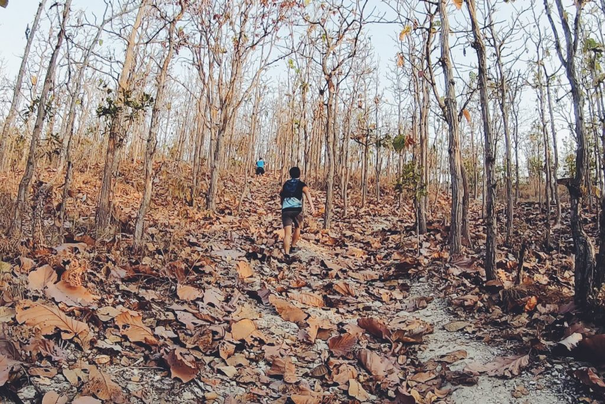
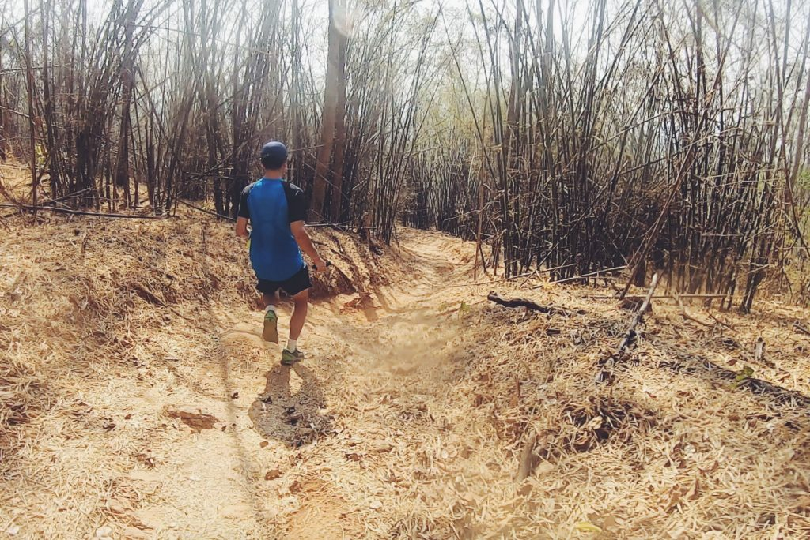

จากครั้งที่แล้วที่ได้ลองใช้ HOKAoneone Speedgoat3 แล้วมาเล่าให้ฟัง [ในนี้](http://google.com) แต่ครั้งนั้นยังใช้ไม่ได้ยาวเท่าไร เลยจับความรู้สึกได้ไม่ค่อยละเอียดมาก แต่คราวนี้ได้เอาไปลองใช้บนเทรลจริงแถวๆเชียงใหม่ ระยะทางรวมราวๆ 50K เลยอยากจะมาเพิ่มเติมข้อมูลให้ได้อ่านกันครับ

*HOKAoneone Speedgoat3*

สำหรับเส้นทางที่ใช้ คิดว่าน่าจะใช้เป็นตัวแทนของเทรลทั่วๆไปในไทยได้เกือบทั้งหมด มีทั้งถนนดินลูกรัง รากไม้ หินลอย ดินร่วน หรือแม้กระทั่งดินแข็งๆ ที่มีใบไม้แห้งคลุม (ที่รองเท้าส่วนใหญ่น่าจะลื่นกันหมด) ก็รวมอยู่ในการทดลองใช้ครั้งนี้แล้ว จะขาดก็แต่วิ่งกลางฝน พื้นเปียกแค่นั้น

## Specs ทั่วไป
- Drop 4mm (ผู้ชาย: หน้าเท้า 28mm, ส้นเท้า 32mm // ผู้หญิง: หน้าเท้า 26mm,
- ส้นเท้า 30mm เพิ่งรู้ว่าไม่เท่ากันด้วยเว้ยย)
- น้ำหนัก 292g (ชาย size 9 us)
- พื้น Vibram ดอกลึกประมาณ 5mm ที่เค้าเคลมว่าเพื่อความหนึบ !

*เส้นที่ไปทดสอบก็คือ Lastman standing – First man standing trail 
แถวเชียงใหม่*

## สรุปได้ประมาณนี้
- น้ำหนัก : เทียบกับ speedgoat 2 ละกัน อันนี้หนักขึ้นนิดหน่อย แต่ส่วนตัวแล้วคิดว่ายังเบาอยู่ดี
- การยึดเกาะ : พื้นผิวทั่วๆไป ไว้ใจได้เลย แม้กระทั่งดินนิ่มที่ร่วนมากๆ แบบวิ่งๆไปแล้วฝุ่นตลบ อันนี้ยังไม่เป็นปัญหาอะไร แต่จะลื่นนิดๆ รู้สึกไม่ค่อยมั่นใจก็ตรงดินแห้งๆ ที่เศษใบไม้เยอะๆนี่แหละ เหมือนจะไหลๆอยู่บ้าง

*ถ้าเจอใบไม้เยอะๆรัวๆแบบนี้ ก็มีเสียวๆอยู่เหมือนกัน
ขอบคุณนายแบบบาริสต้าที่แข็งแกร่งที่สุดในปฐพีด้วยครับ*

- การซัพพอร์ท/รองรับแรงกระแทก : ดีมาก นุ่ม เด้ง ไม่ยวบ (แต่ไม่ถึงกับดีด) อยู่บนเทรลไม่ว่าจะเป็นหินหรือดิน เอาอยู่หมด ยิ่งถ้ามีสลับไปวิ่งบนคอนกรีต (เหมือนสภาพสนามแข่งปกติ ที่มักจะมีถนนแทรกอยู่บ้าง) ก็รู้สึกดีมากกกก downhill เร็วๆได้มันส์ๆ สบายๆ
- ความคล่องตัว : ส่วนตัวคิดว่าคล่องตัวประมาณนึง แต่ไม่ได้ถึงขนาดที่สาดโค้ง downhill ได้อย่างมั่นใจทุกจังหวะ น่าจะเป็นเพราะต้องชดเชยกับพื้นที่นุ่มพอสมควร การตอบสนองต่อพื้นผิวเลยทำได้ไม่ไวเท่ารองเท้าพื้นบางๆ หรือพวกที่แน่นกว่านี้ (เช่น EVOMafate)

## ระยะทำการ

น่าจะเหมาะกับเทรลระยะ 50K ขึ้นไป เน้นซัพพอร์ทบนระยะทางยาวๆ

หรือจะเป็น technical trail ก็ได้แทบทุกพื้นผิว แต่ต้องยอมรับนิดนึงว่าอาจจะไม่ใช่สำหรับสาย speed trail ที่ต้องการความเร็วทางราบ และความคล่องตัวสูง ซึึ่งรุ่นอื่นจะตอบโจทย์มากกว่า หรือใครจะเอาไปใช้ก็ได้แหละ ไม่ได้ผิดอะไร 555

ไปละจ้าาา หวังว่าอันนี้น่าจะพอเป็นข้อมูลเพิ่มเติม สำหรับเพื่อนๆที่กำลังมองหารองเท้าใหม่ไว้ลุยกันนะครับบ 😀
