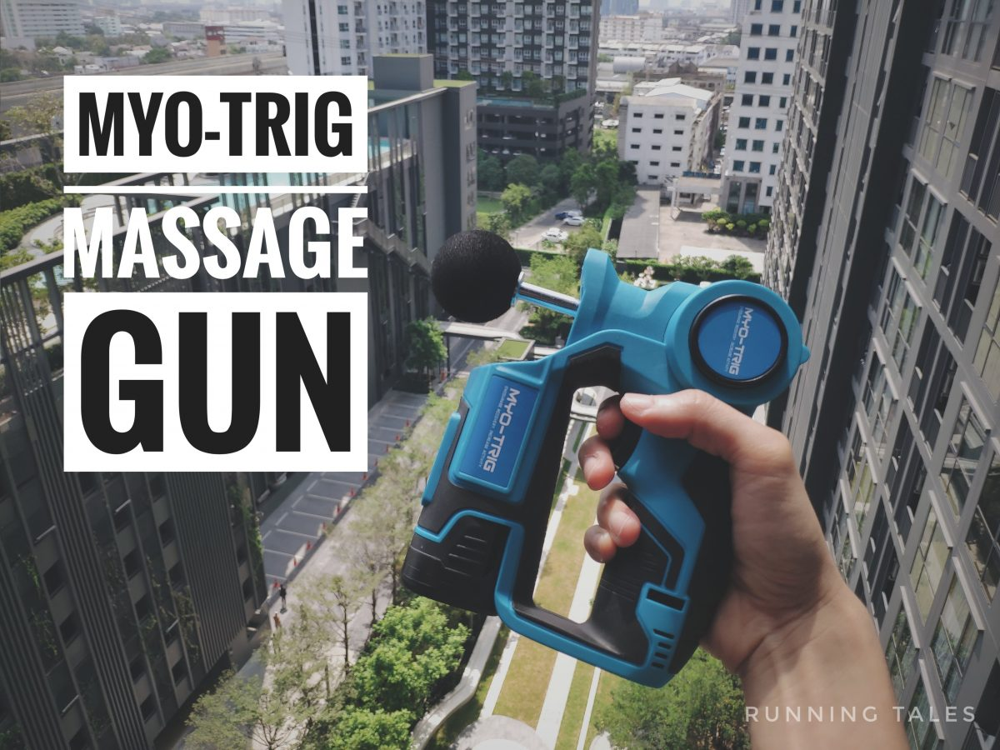
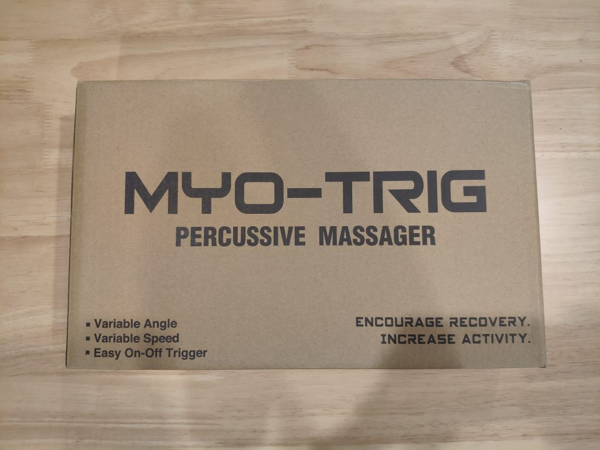
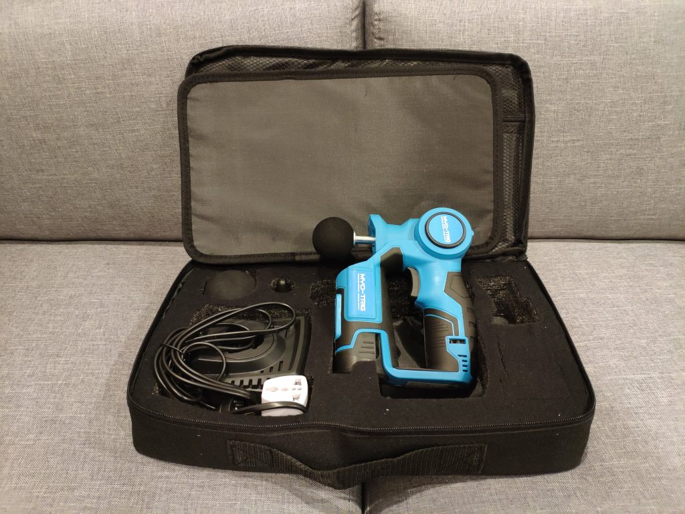

หากคุณเป็นคนนึง ที่ประสบปัญหาซ้อมเสร็จแล้วขี้เกียจยืด ยืดไม่ถึง ขี้เกียจไปนวด ตึงนู่นปวดนี่อยู่นั่นแหละ ลองดูอันนี้ครับ อาจช่วยคุณได้ !

เป็นที่รู้กันว่านอกจากการซ้อมแล้ว ก็ต้องมีเวลาสำหรับการผ่อนคลาย ฟื้นฟูกล้ามเนื้อด้วย ซึ่งก็มีหลายวิธีแตกต่างกันไป ไม่ว่าจะเป็น ยืด, นวด, active recovery, advance หน่อยก็เป็นแช่อ่างเกลือ ฯลฯ ก็ว่ากันไป

แต่จริงๆแล้วมันมีอีกวิธีนึง ที่ช่วยในการฟื้นฟูได้เหมือนกัน นั่นคือ “แรงสั่น” !!

จากที่ได้ไปหาข้อมูลเพิ่มเติมมา พบว่าหลายๆคนเค้าก็ทดลองแล้ว ก็พบว่า “แรงสั่น” (ที่ความถี่สูง) เนี่ยแหละ ช่วยให้กล้ามเนื้อฟื้นตัวเร็วขึ้นได้ ซึ่งก็แบ่งเป็นได้อีกหลายประเภทอีก เช่น “สั่นทั่วร่าง (Whole body vibration)” อันนี้มีจริง ไม่ได้ล้อเล่น 555 หรือ “สั่นเฉพาะจุด” ซึ่งเป็นที่มาขอสิ่งที่จะพูดถึงในวันนี้

อ้อ นอกจากช่วยฟื้นฟูได้แล้ว ก็มีส่วนที่บอกว่าช่วย warmup ได้เหมือนกัน เหตุผลประมาณว่า มันช่วยกระตุ้นการไหลเวียนของเลือดได้ ก่อนที่เราจะออกกำลังกายนั่นแหละ

## Intro ซะนาน เข้าเรื่องซักที

แถ่นน แทน แท๊นนนนน !!!!!

*ชื่อเท่ๆคือ “Percussive Massager”*

> อุปกรณ์ชิ้นนี้คือ “Myo-trig Massage Gun” วิธีใช้ก็โคตรง่าย 
> เปิดเครื่อง กดแช่ไว้ตามจุดที่เราปวดเมื่อย หรือรู้สึกตึง วนๆไปมา  
> ประมาณ 30-60 วิ ต่อจุด ส่วนใหญ่แล้ว อาการจะดีขึ้นแบบรู้สึกได้ชัดเจน

ซึ่งการสั่นที่ได้จากเครื่องนี้ เป็นการสั่นเฉพาะจุด ที่เมืองนอกเค้ามีการใช้แรงสั่นแบบทั่วร่างกาย (Whole body vibration) ก็พบว่าช่วยเพิ่มประสิทธิภาพการ recovery ได้เช่นเดียวกัน แต่อุปกรณ์ก็จะใหญ่ พกพาลำบากหน่อย

## ในกล่องมีอะไรบ้าง
- ตัวปืน
- แบตเตอรี่ 1 ก้อน
- หัวนวด จำนวน 3 หัวคือ หัวกลมเล็ก หัวกลมใหญ่ หัวแหลม
- แท่นชาร์จ
- คู่มือ และสติ๊กเกอร์ 1 ชิ้น

*มาพร้อมกระเป๋าผ้า พกพาสะดวก*

## ใช้มาเดือนกว่าๆ แล้วเป็นไงบ้าง
ส่วนตัวแล้ว กล้ามเนื้อมัดหลักๆที่ใช้ก็คือ Hamstring, น่องทั้งสองข้าง ยิ่งตัวเองเป็นคนที่มักจะมีปัญหากับ Hamstring คือตึงเป็นก้อนง่ายมาก แถมยืดก็ไม่ค่อยจะหาย ลองใช้ปืนนี่กดๆลงไป ครั้งละ 30-60 วิ ต่อจุด วนๆไป อาทิตย์ละ 3-4 วัน ช่วยได้เยอะมาก

ที่ใช้บ่อยรองลงมาจาก Hamstring ก็น่องเนี่ยแหละ ฟินมาก กดไปซ้ายๆขวาๆ

ส่วนใครที่มีปัญหา ITB อะไรพวกนี้ กดลงไปต้นขาด้านข้างก็ได้เหมือนกัน

อ้อ เท่าที่ลองมา ถ้าใช้ต่อเนื่องแบบไม่หยุดเลย ซักประมาณ 15 นาที ด้ามจับจะค่อนข้างร้อนหน่อย อันนี้ต้องระวังนิดนึง (แต่เอาจริงๆแล้ว ก็ไม่ค่อยได้ใช้ต่อเนื่องนานขนาดนั้นหรอก)

## สรุปก็คือ

จริงๆแล้ว ส่วนตัวเคยใช้ปืนแบบนี้มาแล้วที่ฮ่องกง เป็นคนละยี่ห้อกัน แต่อันนี้จะดีกว่าตรงที่

- หัวปืนปรับองศาได้ 3 ระดับ
- ปรับความแรงของปืนได้ 1-6 จากความถี่น้อย – มาก ซึ่งก็เหมาะกับแต่ละระดับความตึง หรือกล้ามเนื้อต่างชุดกัน
- ราคาถูกกว่าเยอะะะะะะ (ครึ่งต่อครึ่ง)

แต่ๆๆๆ ก็มีข้อเห็นว่าน่าจะปรับปรุงอยู่บ้างก็คือ วัสดุตัวเครื่อง ความเรียบร้อยกลางๆ ไม่เนี๊ยบมากเท่าไร (เทียบกับรุ่นที่เคยใช้ แต่อันนั้นราคาแพงกว่าเกือบสองเท่า) แต่ฟังก์ชันอื่นๆ Myo-trig ตัวนี้หลากหลายกว่า ก็เลือกกันตามใจชอบละกันน

อะะ วาร์ปปปปป [Myotrig Thailand](https://www.facebook.com/myotrigthai/)