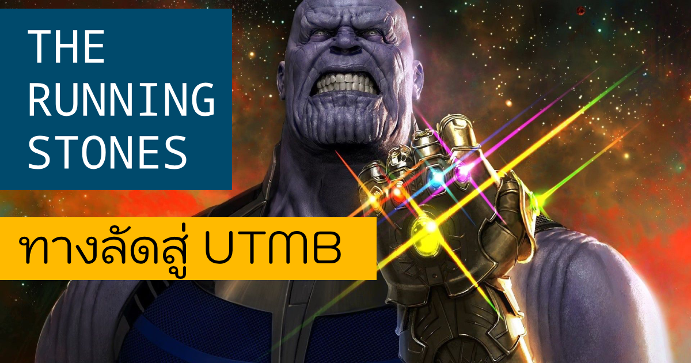
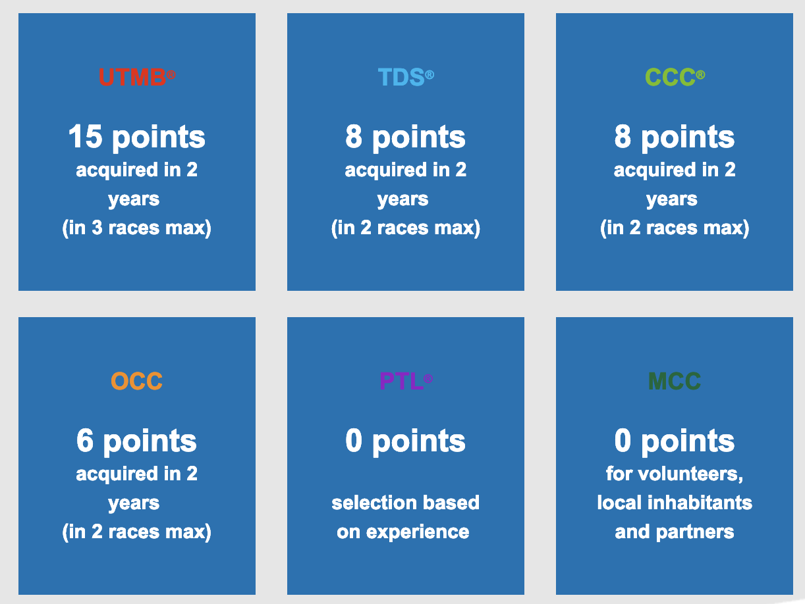
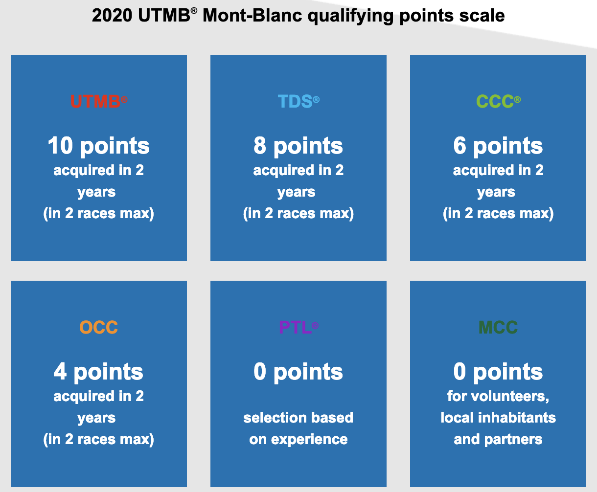
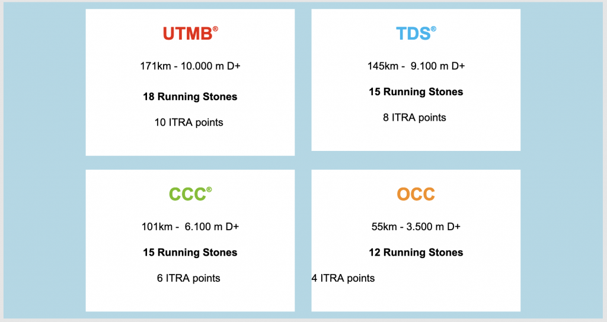

หลังหยุดสงกรานต์บ้านเราผ่านไปหมาดๆ ก็มีข่าวดี (รึเปล่าหว่าา ??) จากผู้จัดงาน UTMB ให้ได้ตื่นเต้นกัน รายละเอียดจะเป็นยังไง เดี๋ยวจะมาเหลาให้ฟังงง 

อย่างที่ทุกคนรู้ๆกัน สนามแข่งในซีรีส์ของ UTMB นี่ถือว่าเป็นสุดยอดของการแข่งขันวิ่งเทรลแล้วในโลก หรือจริงๆจะเรียกว่าเป็นประเพณีเลยก็ว่าได้ ด้วยชื่อเสียง ความเป็นเอกลักษณ์ การป้ายยาต่อๆกันมา และเหตุผลอื่นๆมากมาย เลยทำให้รายการนี้ได้รับความนิยมเพิ่มสูงขึ้นเรื่อยๆ

## ยุคแรกของการรับสมัคร
แรกๆระบบรับสมัครเป็นแบบ “เร็วกว่า ได้ก่อน” ก็ไม่ค่อยมีปัญหาอะไร แต่คนก็เริ่มสนใจเยอะขึ้นเรื่อยๆ จนกระทั่งปี 2008 ที่เปิดมาก็เต็มภายใน 9 นาที ! (ยังกะงานวิ่งสมัยนี้ของบ้านเราเลย แต่นี่มันเมื่อ 11 ปีที่แล้ว ! )

## ยุคที่สอง ของการรับสมัคร

ต่อจากนั้นเลยเป็นระบบให้ซื้อ “หวย” ( lotto นั่นเอง) แล้วค่อยไปจับสลากกันอีกที ว่าใครจะได้ ใครวืดปีนี้ ถ้าสมัครใหม่ปีถัดไปรายการเดิม ก็จะมีโอกาสจะได้มากกว่าคนอื่น 2 เท่า แต่ถ้ายังวืดอีก เค้าบอกรอปีที่สามเลยละกัน การันตีกันไปเลย

ระบบนี้ก็ดูเหมือนจะใช้ได้ดี จนกระทั่งปีล่าสุดนี้ มีผู้ซื้อ “หวย” ทั้งหมด 26,000 คน แต่รับจริงได้แค่ 10,000 คน (ทุกรายการรวมกัน)

*เกณฑ์การรับสมัครแบบเดิม ที่ใช้อยู่ปัจจุบัน https://utmbmontblanc.com/en/blog/103*

ทางผู้จัดเลยจินตนาการวิธีการสมัครใหม่มาอีก ซึ่งจะเริ่มใช้ในปี 2020 นี้ และเค้าเคลมว่ามันจะทำให้มีโอกาสได้วิ่งในงานนี้ง่ายขึ้น (จริงเร้อออ) ซึ่งมันก็คืออออออ

> **The Running Stones**
>> อัญมณีเพื่อนักสู้สู่ UTMB

## เรามาวิ่งเพื่อสุขภาพกันเถอะ

*Qualifying point ระบบใหม่ น้อยลงกว่าเดิม 
แค่แข่ง ultra marathon ปีละครั้ง ก็มีสิทธิ์ได้มาแล้ว*

ในระบบใหม่ Qualifying point ใช้น้อยลง ยกตัวอย่างเช่น UTMB จากเดิมที่ต้องมี 15 แต้ม จากอย่างมาก 3 งานในระบบเดิม

พอมาเป็นระบบใหม่ ใช้แค่ 10 แต้ม (จาก 2 งาน ภายใน 2 ปี) ก็เพียงพอแล้ว โดยเค้าให้เหตุผลว่า

> “เพื่อสุขภาพที่ดีของนักวิ่ง เพียงแค่คุณวิ่งอัลตร้ามาราธอนปีละครั้ง ก็เพียงพอที่จะสมัคร UTMB แล้ว”  
> Nicolas Lagrange, UTMB®Director of Operations

## The Running Stones – ทางลัดสู่ UTMB
นอกจาก Qualifying points จะใช้น้อยลงแล้ว ยังมีท่าไม้ตายคือ ***นักวิ่งสามารถสะสม “หิน” จากงานวิ่งที่เลือกโดย UTMB เมื่อสะสมได้จำนวนตามที่กำหนด สามารถนำมาสมัครรายการต่างๆในเรซ UTMB รวมถึงพวก TDS, CCC, OCC ได้เลย*** ถ้าหากมี Qualifying point ถึงที่กำหนด) โดยอัตราแลกเปลี่ยนเป็นประมาณนี้

อัตราการได้แต้ม ณ ตอนที่ประกาศคือ
> Finisher ของงานที่เลือกโดย UTMB จะได้ 3 Stones ต่อ 1 iTRA point  
> Finisher ของงานที่อยู่ใน UTWT จะได้ 1 Stone ต่อ 1 iTRA point 
> (อัตรานี้อาจจะเปลี่ยนแปลงได้ ขึ้นอยู่กับผู้สมัครในแต่ละปี)

ตัวอย่างเช่น งาน [Gaoligong](http://mtgaoligong.com/) ระยะ 160K ซึ่งถูกเลือกโดย UTMB ถ้าจบจะได้ 6 iTRA point และ 18 Stones (3 stones ต่อ 1 point)

*ซึ่งนี่แปลว่า ถ้าจบ 160K งานนี้ และมีอีกแค่ 4 iTRA point ก็จะการันตีการสมัคร UTMB ปีถัดไปได้เลย ไม่ต้องลุ้นหวยให้เหนื่อยอีกต่อไป*

หรือถ้าจบงาน HK100 ที่อยู่ใน UTWT จะได้ 5 iTRA point และ 5 Stones (1 stone ต่อ 1 point)

## อัตราการแลกหิน เพื่อ Slot การสมัครเป็นตามนี้

ส่วนใครที่สะสมหิน ไม่ครบจำนวนที่กำหนดของแต่ละเรซ ก็ยังเอาไปแลกเป็น “หวย” เพื่อเพิ่มโอกาสการถูกได้ด้วย ซึ่งเค้าจะประกาศเพิ่มเติมต่อไป

## อ้อ มีปรับเงื่อนไขของ Lotto นิดหน่อยด้วย (อันนี้เจ๋ง)
จากเดิมที่ถ้าใครวืดจาก lotto ปีแรกในรายการหนึ่ง จะมีโอกาสถูก lotto เพิ่มเป็น 2 เท่า ถ้าสมัคร “รายการเดิม” ในปีถัดไป แต่อันปรับปรุงใหม่นี้ บอกว่าไม่จำเป็นต้องสมัครรายการเดิมก็ได้ ได้มีโอกาสถูก lotto เพิ่มขึ้นได้ในปีถัดไป (แต่อาจจะไม่ได้ 2 เท่านะ ขึ้นอยู่กับว่าปีแรก คนวืดกันแต่ละระยะเยอะแค่ไหน แล้วเค้าจะคำนวนอีกที)

## สรุป
จากระบบที่เค้าออกแบบมา ก็น่าจะทำให้โอกาสได้ไปวิ่งงานระดับโลกอย่าง UTMB รวมถึงเรซพี่น้องอย่าง TDS, CCC, OCC มากขึ้น ถ้าวางแผนไปเก็บหินตามงานที่เค้าเลือกน่ะนะ (ซึ่งตอนนี้ยังหาไม่เจอเหมือนกันว่าเค้าเลือกงานไหนไว้มั่ง นอกจาก [งานนี้ Gaoligong](http://mtgaoligong.com/))

แต่สำหรับใครที่ไม่ได้ไปเก็บหิน โอกาสได้น่าจะยากมากขึ้น เพราะจะมีคนที่ได้การันตี slot จากการแลกหินมาแบ่งส่วนไปแล้วนั่นเองงง

ใครที่อยากอ่านแบบละเอียดๆ เชิญที่ต้นทางเลยจ้าา [UTMB Blog](https://utmbmontblanc.com/en/blog/103)
